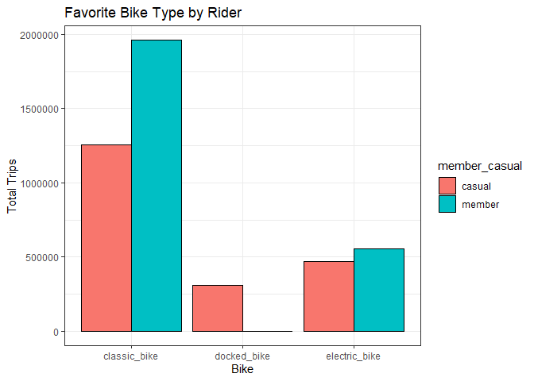

Bike_Share_Project
================
Brian Hudson
2022-11-07

<br>

# Ask Phase

### Background

I am a junior data analyst working in the marketing analyst team at
Cyclistic, a bike-share company in Chicago. The director of marketing
believes the company’s future success depends on maximizing the number
of annual memberships. Therefore, my team wants to understand how casual
riders and annual members use Cyclistic bikes differently. From these
insights, my team will design a new marketing strategy to convert casual
riders into annual members. But first, Cyclistic executives must approve
my recommendations, so they must be backed up with compelling data
insights and professional data visualizations.

### Business Objective

Design marketing strategies aimed at converting casual riders into
annual members. In order to do that, however, the marketing analyst team
needs to better understand how annual members and casual riders differ,
why casual riders would buy a membership, and how digital media could
affect their marketing tactics. Moreno and her team are interested in
analyzing the Cyclistic historical bike trip data to identify trends.

### Business Task

Answer the following questions for the stake holders:

1.  How do annual members and casual riders use Cyclistic bikes
    differently?
2.  Why would casual riders buy Cyclistic annual memberships?
3.  How can Cyclistic use digital media to influence casual riders to
    become members?

### Key Stakeholders

- Cyclistic: A bike-share program that features more than 5,800 bicycles
  and 600 docking stations.
- Lily Moreno: The director of marketing and your manager.
- Cyclistic marketing analytics team: A team of analysts who are
  responsible for all things data analytics for the Cyclistic marketing
  strategy.
- Cyclistic executive team: The notoriously detail-oriented executive
  team will decide whether to approve the recommended marketing program.

# Prepare

### Information on Data

All of the data being used was collected first-hand so it is reliable,
original, comprehensive and cited. Although, the data is not current, as
it is for year 2021. However, this is a test project and we will look
past that. We are legally allowed to use the data as long as we cite the
source per the license, which can be found
[here](https://ride.divvybikes.com/data-license-agreement).

### Data Selection

The data being used is for January through December of 2021. I have
opted to use the individual months against the quarterly selection as
the single months contain more information which will be more useful in
statistical calculations and visualizations. The Data can be found
[here](https://divvy-tripdata.s3.amazonaws.com/index.html).

### Tools

The entire analysis will be run in R Studio due to the size of the 12
files in the selection.

# Process

### Preparing the Environment

We will require the `readxl, tidyverse, dplyr, ggplot2 and lubrdiate`
packages to carry out the analysis.

<br>

``` r
lapply(c('readxl', 'tidyverse', 'dplyr', 'ggplot2', 'lubridate'), require, character.only=TRUE)
```

    ## Loading required package: readxl

    ## Loading required package: tidyverse

    ## ── Attaching packages ─────────────────────────────────────── tidyverse 1.3.2 ──
    ## ✔ ggplot2 3.3.6      ✔ purrr   0.3.5 
    ## ✔ tibble  3.1.8      ✔ dplyr   1.0.10
    ## ✔ tidyr   1.2.1      ✔ stringr 1.4.1 
    ## ✔ readr   2.1.3      ✔ forcats 0.5.2 
    ## ── Conflicts ────────────────────────────────────────── tidyverse_conflicts() ──
    ## ✖ dplyr::filter() masks stats::filter()
    ## ✖ dplyr::lag()    masks stats::lag()
    ## Loading required package: lubridate
    ## 
    ## 
    ## Attaching package: 'lubridate'
    ## 
    ## 
    ## The following objects are masked from 'package:base':
    ## 
    ##     date, intersect, setdiff, union

    ## [[1]]
    ## [1] TRUE
    ## 
    ## [[2]]
    ## [1] TRUE
    ## 
    ## [[3]]
    ## [1] TRUE
    ## 
    ## [[4]]
    ## [1] TRUE
    ## 
    ## [[5]]
    ## [1] TRUE

<br>

Given the large quantity of files, I will first pull the data in to view
the structures against each other.

``` r
#there are too many files so open in Excel/SQL so we will quickly read and analyze them here.

setwd("C:/Users/Brian/Desktop/Project")
getwd()
```

    ## [1] "C:/Users/Brian/Desktop/Project"

``` r
myfiles = list.files(path = "C:/Users/Brian/Desktop/Project", pattern = '.csv')
sapply(myfiles, read.csv)
```

    ##                    202101-divvy-tripdata.csv 202102-divvy-tripdata.csv
    ## ride_id            character,96834           character,49622          
    ## rideable_type      character,96834           character,49622          
    ## started_at         character,96834           character,49622          
    ## ended_at           character,96834           character,49622          
    ## start_station_name character,96834           character,49622          
    ## start_station_id   character,96834           character,49622          
    ## end_station_name   character,96834           character,49622          
    ## end_station_id     character,96834           character,49622          
    ## start_lat          numeric,96834             numeric,49622            
    ## start_lng          numeric,96834             numeric,49622            
    ## end_lat            numeric,96834             numeric,49622            
    ## end_lng            numeric,96834             numeric,49622            
    ## member_casual      character,96834           character,49622          
    ##                    202103-divvy-tripdata.csv 202104-divvy-tripdata.csv
    ## ride_id            character,228496          character,337230         
    ## rideable_type      character,228496          character,337230         
    ## started_at         character,228496          character,337230         
    ## ended_at           character,228496          character,337230         
    ## start_station_name character,228496          character,337230         
    ## start_station_id   character,228496          character,337230         
    ## end_station_name   character,228496          character,337230         
    ## end_station_id     character,228496          character,337230         
    ## start_lat          numeric,228496            numeric,337230           
    ## start_lng          numeric,228496            numeric,337230           
    ## end_lat            numeric,228496            numeric,337230           
    ## end_lng            numeric,228496            numeric,337230           
    ## member_casual      character,228496          character,337230         
    ##                    202105-divvy-tripdata.csv 202106-divvy-tripdata.csv
    ## ride_id            character,531633          character,729595         
    ## rideable_type      character,531633          character,729595         
    ## started_at         character,531633          character,729595         
    ## ended_at           character,531633          character,729595         
    ## start_station_name character,531633          character,729595         
    ## start_station_id   character,531633          character,729595         
    ## end_station_name   character,531633          character,729595         
    ## end_station_id     character,531633          character,729595         
    ## start_lat          numeric,531633            numeric,729595           
    ## start_lng          numeric,531633            numeric,729595           
    ## end_lat            numeric,531633            numeric,729595           
    ## end_lng            numeric,531633            numeric,729595           
    ## member_casual      character,531633          character,729595         
    ##                    202107-divvy-tripdata.csv 202108-divvy-tripdata.csv
    ## ride_id            character,822410          character,804352         
    ## rideable_type      character,822410          character,804352         
    ## started_at         character,822410          character,804352         
    ## ended_at           character,822410          character,804352         
    ## start_station_name character,822410          character,804352         
    ## start_station_id   character,822410          character,804352         
    ## end_station_name   character,822410          character,804352         
    ## end_station_id     character,822410          character,804352         
    ## start_lat          numeric,822410            numeric,804352           
    ## start_lng          numeric,822410            numeric,804352           
    ## end_lat            numeric,822410            numeric,804352           
    ## end_lng            numeric,822410            numeric,804352           
    ## member_casual      character,822410          character,804352         
    ##                    202109-divvy-tripdata.csv 202110-divvy-tripdata.csv
    ## ride_id            character,756147          character,631226         
    ## rideable_type      character,756147          character,631226         
    ## started_at         character,756147          character,631226         
    ## ended_at           character,756147          character,631226         
    ## start_station_name character,756147          character,631226         
    ## start_station_id   character,756147          character,631226         
    ## end_station_name   character,756147          character,631226         
    ## end_station_id     character,756147          character,631226         
    ## start_lat          numeric,756147            numeric,631226           
    ## start_lng          numeric,756147            numeric,631226           
    ## end_lat            numeric,756147            numeric,631226           
    ## end_lng            numeric,756147            numeric,631226           
    ## member_casual      character,756147          character,631226         
    ##                    202111-divvy-tripdata.csv 202112-divvy-tripdata.csv
    ## ride_id            character,359978          character,247540         
    ## rideable_type      character,359978          character,247540         
    ## started_at         character,359978          character,247540         
    ## ended_at           character,359978          character,247540         
    ## start_station_name character,359978          character,247540         
    ## start_station_id   character,359978          character,247540         
    ## end_station_name   character,359978          character,247540         
    ## end_station_id     character,359978          character,247540         
    ## start_lat          numeric,359978            numeric,247540           
    ## start_lng          numeric,359978            numeric,247540           
    ## end_lat            numeric,359978            numeric,247540           
    ## end_lng            numeric,359978            numeric,247540           
    ## member_casual      character,359978          character,247540

All of the headers are uniform and the data types are standard. I will
go ahead and merge them into one data frame. <br>

``` r
list(dir("C:/Users/Brian/Desktop/Project", full.names = T))
```

    ## [[1]]
    ##  [1] "C:/Users/Brian/Desktop/Project/202101-divvy-tripdata.csv"
    ##  [2] "C:/Users/Brian/Desktop/Project/202102-divvy-tripdata.csv"
    ##  [3] "C:/Users/Brian/Desktop/Project/202103-divvy-tripdata.csv"
    ##  [4] "C:/Users/Brian/Desktop/Project/202104-divvy-tripdata.csv"
    ##  [5] "C:/Users/Brian/Desktop/Project/202105-divvy-tripdata.csv"
    ##  [6] "C:/Users/Brian/Desktop/Project/202106-divvy-tripdata.csv"
    ##  [7] "C:/Users/Brian/Desktop/Project/202107-divvy-tripdata.csv"
    ##  [8] "C:/Users/Brian/Desktop/Project/202108-divvy-tripdata.csv"
    ##  [9] "C:/Users/Brian/Desktop/Project/202109-divvy-tripdata.csv"
    ## [10] "C:/Users/Brian/Desktop/Project/202110-divvy-tripdata.csv"
    ## [11] "C:/Users/Brian/Desktop/Project/202111-divvy-tripdata.csv"
    ## [12] "C:/Users/Brian/Desktop/Project/202112-divvy-tripdata.csv"

``` r
total_trips <-  dir("C:/Users/Brian/Desktop/Project", full.names = T) %>% map_df(read_csv)
```

    ## Rows: 96834 Columns: 13
    ## ── Column specification ────────────────────────────────────────────────────────
    ## Delimiter: ","
    ## chr  (7): ride_id, rideable_type, start_station_name, start_station_id, end_...
    ## dbl  (4): start_lat, start_lng, end_lat, end_lng
    ## dttm (2): started_at, ended_at
    ## 
    ## ℹ Use `spec()` to retrieve the full column specification for this data.
    ## ℹ Specify the column types or set `show_col_types = FALSE` to quiet this message.
    ## Rows: 49622 Columns: 13
    ## ── Column specification ────────────────────────────────────────────────────────
    ## Delimiter: ","
    ## chr  (7): ride_id, rideable_type, start_station_name, start_station_id, end_...
    ## dbl  (4): start_lat, start_lng, end_lat, end_lng
    ## dttm (2): started_at, ended_at
    ## 
    ## ℹ Use `spec()` to retrieve the full column specification for this data.
    ## ℹ Specify the column types or set `show_col_types = FALSE` to quiet this message.
    ## Rows: 228496 Columns: 13
    ## ── Column specification ────────────────────────────────────────────────────────
    ## Delimiter: ","
    ## chr  (7): ride_id, rideable_type, start_station_name, start_station_id, end_...
    ## dbl  (4): start_lat, start_lng, end_lat, end_lng
    ## dttm (2): started_at, ended_at
    ## 
    ## ℹ Use `spec()` to retrieve the full column specification for this data.
    ## ℹ Specify the column types or set `show_col_types = FALSE` to quiet this message.
    ## Rows: 337230 Columns: 13
    ## ── Column specification ────────────────────────────────────────────────────────
    ## Delimiter: ","
    ## chr  (7): ride_id, rideable_type, start_station_name, start_station_id, end_...
    ## dbl  (4): start_lat, start_lng, end_lat, end_lng
    ## dttm (2): started_at, ended_at
    ## 
    ## ℹ Use `spec()` to retrieve the full column specification for this data.
    ## ℹ Specify the column types or set `show_col_types = FALSE` to quiet this message.
    ## Rows: 531633 Columns: 13
    ## ── Column specification ────────────────────────────────────────────────────────
    ## Delimiter: ","
    ## chr  (7): ride_id, rideable_type, start_station_name, start_station_id, end_...
    ## dbl  (4): start_lat, start_lng, end_lat, end_lng
    ## dttm (2): started_at, ended_at
    ## 
    ## ℹ Use `spec()` to retrieve the full column specification for this data.
    ## ℹ Specify the column types or set `show_col_types = FALSE` to quiet this message.
    ## Rows: 729595 Columns: 13
    ## ── Column specification ────────────────────────────────────────────────────────
    ## Delimiter: ","
    ## chr  (7): ride_id, rideable_type, start_station_name, start_station_id, end_...
    ## dbl  (4): start_lat, start_lng, end_lat, end_lng
    ## dttm (2): started_at, ended_at
    ## 
    ## ℹ Use `spec()` to retrieve the full column specification for this data.
    ## ℹ Specify the column types or set `show_col_types = FALSE` to quiet this message.
    ## Rows: 822410 Columns: 13
    ## ── Column specification ────────────────────────────────────────────────────────
    ## Delimiter: ","
    ## chr  (7): ride_id, rideable_type, start_station_name, start_station_id, end_...
    ## dbl  (4): start_lat, start_lng, end_lat, end_lng
    ## dttm (2): started_at, ended_at
    ## 
    ## ℹ Use `spec()` to retrieve the full column specification for this data.
    ## ℹ Specify the column types or set `show_col_types = FALSE` to quiet this message.
    ## Rows: 804352 Columns: 13
    ## ── Column specification ────────────────────────────────────────────────────────
    ## Delimiter: ","
    ## chr  (7): ride_id, rideable_type, start_station_name, start_station_id, end_...
    ## dbl  (4): start_lat, start_lng, end_lat, end_lng
    ## dttm (2): started_at, ended_at
    ## 
    ## ℹ Use `spec()` to retrieve the full column specification for this data.
    ## ℹ Specify the column types or set `show_col_types = FALSE` to quiet this message.
    ## Rows: 756147 Columns: 13
    ## ── Column specification ────────────────────────────────────────────────────────
    ## Delimiter: ","
    ## chr  (7): ride_id, rideable_type, start_station_name, start_station_id, end_...
    ## dbl  (4): start_lat, start_lng, end_lat, end_lng
    ## dttm (2): started_at, ended_at
    ## 
    ## ℹ Use `spec()` to retrieve the full column specification for this data.
    ## ℹ Specify the column types or set `show_col_types = FALSE` to quiet this message.
    ## Rows: 631226 Columns: 13
    ## ── Column specification ────────────────────────────────────────────────────────
    ## Delimiter: ","
    ## chr  (7): ride_id, rideable_type, start_station_name, start_station_id, end_...
    ## dbl  (4): start_lat, start_lng, end_lat, end_lng
    ## dttm (2): started_at, ended_at
    ## 
    ## ℹ Use `spec()` to retrieve the full column specification for this data.
    ## ℹ Specify the column types or set `show_col_types = FALSE` to quiet this message.
    ## Rows: 359978 Columns: 13
    ## ── Column specification ────────────────────────────────────────────────────────
    ## Delimiter: ","
    ## chr  (7): ride_id, rideable_type, start_station_name, start_station_id, end_...
    ## dbl  (4): start_lat, start_lng, end_lat, end_lng
    ## dttm (2): started_at, ended_at
    ## 
    ## ℹ Use `spec()` to retrieve the full column specification for this data.
    ## ℹ Specify the column types or set `show_col_types = FALSE` to quiet this message.
    ## Rows: 247540 Columns: 13
    ## ── Column specification ────────────────────────────────────────────────────────
    ## Delimiter: ","
    ## chr  (7): ride_id, rideable_type, start_station_name, start_station_id, end_...
    ## dbl  (4): start_lat, start_lng, end_lat, end_lng
    ## dttm (2): started_at, ended_at
    ## 
    ## ℹ Use `spec()` to retrieve the full column specification for this data.
    ## ℹ Specify the column types or set `show_col_types = FALSE` to quiet this message.

<br>

Now we will take a quick look at the merged data to inspect the
formatting and any apparent errors.

``` r
colnames(total_trips)
```

    ##  [1] "ride_id"            "rideable_type"      "started_at"        
    ##  [4] "ended_at"           "start_station_name" "start_station_id"  
    ##  [7] "end_station_name"   "end_station_id"     "start_lat"         
    ## [10] "start_lng"          "end_lat"            "end_lng"           
    ## [13] "member_casual"

``` r
head(total_trips)
```

    ## # A tibble: 6 × 13
    ##   ride_id        ridea…¹ started_at          ended_at            start…² start…³
    ##   <chr>          <chr>   <dttm>              <dttm>              <chr>   <chr>  
    ## 1 E19E6F1B8D4C4… electr… 2021-01-23 16:14:19 2021-01-23 16:24:44 Califo… 17660  
    ## 2 DC88F20C2C55F… electr… 2021-01-27 18:43:08 2021-01-27 18:47:12 Califo… 17660  
    ## 3 EC45C94683FE3… electr… 2021-01-21 22:35:54 2021-01-21 22:37:14 Califo… 17660  
    ## 4 4FA453A75AE37… electr… 2021-01-07 13:31:13 2021-01-07 13:42:55 Califo… 17660  
    ## 5 BE5E8EB4E7263… electr… 2021-01-23 02:24:02 2021-01-23 02:24:45 Califo… 17660  
    ## 6 5D8969F88C773… electr… 2021-01-09 14:24:07 2021-01-09 15:17:54 Califo… 17660  
    ## # … with 7 more variables: end_station_name <chr>, end_station_id <chr>,
    ## #   start_lat <dbl>, start_lng <dbl>, end_lat <dbl>, end_lng <dbl>,
    ## #   member_casual <chr>, and abbreviated variable names ¹​rideable_type,
    ## #   ²​start_station_name, ³​start_station_id

``` r
summary(total_trips)
```

    ##    ride_id          rideable_type        started_at                    
    ##  Length:5595063     Length:5595063     Min.   :2021-01-01 00:02:05.00  
    ##  Class :character   Class :character   1st Qu.:2021-06-06 23:52:40.00  
    ##  Mode  :character   Mode  :character   Median :2021-08-01 01:52:11.00  
    ##                                        Mean   :2021-07-29 07:41:02.63  
    ##                                        3rd Qu.:2021-09-24 16:36:16.00  
    ##                                        Max.   :2021-12-31 23:59:48.00  
    ##                                                                        
    ##     ended_at                      start_station_name start_station_id  
    ##  Min.   :2021-01-01 00:08:39.00   Length:5595063     Length:5595063    
    ##  1st Qu.:2021-06-07 00:44:21.00   Class :character   Class :character  
    ##  Median :2021-08-01 02:21:55.00   Mode  :character   Mode  :character  
    ##  Mean   :2021-07-29 08:02:58.75                                        
    ##  3rd Qu.:2021-09-24 16:54:05.50                                        
    ##  Max.   :2022-01-03 17:32:18.00                                        
    ##                                                                        
    ##  end_station_name   end_station_id       start_lat       start_lng     
    ##  Length:5595063     Length:5595063     Min.   :41.64   Min.   :-87.84  
    ##  Class :character   Class :character   1st Qu.:41.88   1st Qu.:-87.66  
    ##  Mode  :character   Mode  :character   Median :41.90   Median :-87.64  
    ##                                        Mean   :41.90   Mean   :-87.65  
    ##                                        3rd Qu.:41.93   3rd Qu.:-87.63  
    ##                                        Max.   :42.07   Max.   :-87.52  
    ##                                                                        
    ##     end_lat         end_lng       member_casual     
    ##  Min.   :41.39   Min.   :-88.97   Length:5595063    
    ##  1st Qu.:41.88   1st Qu.:-87.66   Class :character  
    ##  Median :41.90   Median :-87.64   Mode  :character  
    ##  Mean   :41.90   Mean   :-87.65                     
    ##  3rd Qu.:41.93   3rd Qu.:-87.63                     
    ##  Max.   :42.17   Max.   :-87.49                     
    ##  NA's   :4771    NA's   :4771

I will now remove any missing/NA data along with any potential duplicate
values

``` r
total_trips <- total_trips %>% 
  drop_na() %>% 
  unique()
```

<br>

``` r
total_trips %>% head(20)
```

    ## # A tibble: 20 × 13
    ##    ride_id       ridea…¹ started_at          ended_at            start…² start…³
    ##    <chr>         <chr>   <dttm>              <dttm>              <chr>   <chr>  
    ##  1 B9F73448DFBE… classi… 2021-01-24 19:15:38 2021-01-24 19:22:51 Califo… 17660  
    ##  2 457C7F4B5D3D… electr… 2021-01-23 12:57:38 2021-01-23 13:02:10 Califo… 17660  
    ##  3 57C750326F9F… electr… 2021-01-09 15:28:04 2021-01-09 15:37:51 Califo… 17660  
    ##  4 4D518C65E338… electr… 2021-01-09 15:28:57 2021-01-09 15:37:54 Califo… 17660  
    ##  5 9D08A3AFF410… classi… 2021-01-24 15:56:59 2021-01-24 16:07:08 Califo… 17660  
    ##  6 49FCE1F8598F… electr… 2021-01-22 15:15:28 2021-01-22 15:36:01 Califo… 17660  
    ##  7 0FEED5C2C874… classi… 2021-01-05 10:33:12 2021-01-05 10:39:12 Califo… 17660  
    ##  8 E276FD43BDED… classi… 2021-01-30 11:59:16 2021-01-30 12:03:44 Califo… 17660  
    ##  9 88BFCF66C2D5… electr… 2021-01-27 07:27:09 2021-01-27 07:45:32 Califo… 17660  
    ## 10 8BD6F6510F5C… electr… 2021-01-15 08:54:41 2021-01-15 09:11:46 Califo… 17660  
    ## 11 84F11CC620F8… electr… 2021-01-10 08:05:47 2021-01-10 08:13:24 Califo… 17660  
    ## 12 C84E5DD4D74F… electr… 2021-01-18 13:30:07 2021-01-18 13:37:19 Califo… 17660  
    ## 13 00AEF8EE4622… electr… 2021-01-07 09:45:00 2021-01-07 09:52:30 Califo… 17660  
    ## 14 55DAB9E709B6… classi… 2021-01-11 11:20:38 2021-01-11 11:29:33 Califo… 17660  
    ## 15 3E41D6E4EFE8… classi… 2021-01-22 21:54:15 2021-01-22 22:04:27 Califo… 17660  
    ## 16 FCE0D29EB2DF… electr… 2021-01-16 01:05:07 2021-01-16 01:19:43 Califo… 17660  
    ## 17 77E53236C1F0… classi… 2021-01-28 20:35:56 2021-01-28 21:06:32 Halste… KA1504…
    ## 18 72335684BF7A… electr… 2021-01-09 00:35:55 2021-01-09 00:43:55 Halste… KA1504…
    ## 19 625DDA8DCCCC… classi… 2021-01-17 15:07:57 2021-01-17 15:20:54 Glenwo… 525    
    ## 20 61C6977EA354… electr… 2021-01-25 15:39:54 2021-01-25 15:52:11 Halste… KA1504…
    ## # … with 7 more variables: end_station_name <chr>, end_station_id <chr>,
    ## #   start_lat <dbl>, start_lng <dbl>, end_lat <dbl>, end_lng <dbl>,
    ## #   member_casual <chr>, and abbreviated variable names ¹​rideable_type,
    ## #   ²​start_station_name, ³​start_station_id

``` r
str(total_trips)
```

    ## tibble [4,588,302 × 13] (S3: tbl_df/tbl/data.frame)
    ##  $ ride_id           : chr [1:4588302] "B9F73448DFBE0D45" "457C7F4B5D3DA135" "57C750326F9FDABE" "4D518C65E338D070" ...
    ##  $ rideable_type     : chr [1:4588302] "classic_bike" "electric_bike" "electric_bike" "electric_bike" ...
    ##  $ started_at        : POSIXct[1:4588302], format: "2021-01-24 19:15:38" "2021-01-23 12:57:38" ...
    ##  $ ended_at          : POSIXct[1:4588302], format: "2021-01-24 19:22:51" "2021-01-23 13:02:10" ...
    ##  $ start_station_name: chr [1:4588302] "California Ave & Cortez St" "California Ave & Cortez St" "California Ave & Cortez St" "California Ave & Cortez St" ...
    ##  $ start_station_id  : chr [1:4588302] "17660" "17660" "17660" "17660" ...
    ##  $ end_station_name  : chr [1:4588302] "Wood St & Augusta Blvd" "California Ave & North Ave" "Wood St & Augusta Blvd" "Wood St & Augusta Blvd" ...
    ##  $ end_station_id    : chr [1:4588302] "657" "13258" "657" "657" ...
    ##  $ start_lat         : num [1:4588302] 41.9 41.9 41.9 41.9 41.9 ...
    ##  $ start_lng         : num [1:4588302] -87.7 -87.7 -87.7 -87.7 -87.7 ...
    ##  $ end_lat           : num [1:4588302] 41.9 41.9 41.9 41.9 41.9 ...
    ##  $ end_lng           : num [1:4588302] -87.7 -87.7 -87.7 -87.7 -87.7 ...
    ##  $ member_casual     : chr [1:4588302] "member" "member" "casual" "casual" ...

In order to get a better summary of the data for our statistical data,
we will create columns for day and month and also add a duration column
in minutes to standardize the length of the trips and remove any zero or
negative values.

``` r
total_trips <- total_trips %>%
  mutate(duration = round(as.numeric(difftime(ended_at, started_at)/60))) %>% 
  mutate(date = as.Date(started_at), month = month(started_at, label = T), day = wday(started_at, label = T)) %>% 
  filter(duration > 0)

colnames(total_trips)
```

    ##  [1] "ride_id"            "rideable_type"      "started_at"        
    ##  [4] "ended_at"           "start_station_name" "start_station_id"  
    ##  [7] "end_station_name"   "end_station_id"     "start_lat"         
    ## [10] "start_lng"          "end_lat"            "end_lng"           
    ## [13] "member_casual"      "duration"           "date"              
    ## [16] "month"              "day"

``` r
str(total_trips)
```

    ## tibble [4,550,978 × 17] (S3: tbl_df/tbl/data.frame)
    ##  $ ride_id           : chr [1:4550978] "B9F73448DFBE0D45" "457C7F4B5D3DA135" "57C750326F9FDABE" "4D518C65E338D070" ...
    ##  $ rideable_type     : chr [1:4550978] "classic_bike" "electric_bike" "electric_bike" "electric_bike" ...
    ##  $ started_at        : POSIXct[1:4550978], format: "2021-01-24 19:15:38" "2021-01-23 12:57:38" ...
    ##  $ ended_at          : POSIXct[1:4550978], format: "2021-01-24 19:22:51" "2021-01-23 13:02:10" ...
    ##  $ start_station_name: chr [1:4550978] "California Ave & Cortez St" "California Ave & Cortez St" "California Ave & Cortez St" "California Ave & Cortez St" ...
    ##  $ start_station_id  : chr [1:4550978] "17660" "17660" "17660" "17660" ...
    ##  $ end_station_name  : chr [1:4550978] "Wood St & Augusta Blvd" "California Ave & North Ave" "Wood St & Augusta Blvd" "Wood St & Augusta Blvd" ...
    ##  $ end_station_id    : chr [1:4550978] "657" "13258" "657" "657" ...
    ##  $ start_lat         : num [1:4550978] 41.9 41.9 41.9 41.9 41.9 ...
    ##  $ start_lng         : num [1:4550978] -87.7 -87.7 -87.7 -87.7 -87.7 ...
    ##  $ end_lat           : num [1:4550978] 41.9 41.9 41.9 41.9 41.9 ...
    ##  $ end_lng           : num [1:4550978] -87.7 -87.7 -87.7 -87.7 -87.7 ...
    ##  $ member_casual     : chr [1:4550978] "member" "member" "casual" "casual" ...
    ##  $ duration          : num [1:4550978] 7 5 10 9 10 21 6 4 18 17 ...
    ##  $ date              : Date[1:4550978], format: "2021-01-24" "2021-01-23" ...
    ##  $ month             : Ord.factor w/ 12 levels "Jan"<"Feb"<"Mar"<..: 1 1 1 1 1 1 1 1 1 1 ...
    ##  $ day               : Ord.factor w/ 7 levels "Sun"<"Mon"<"Tue"<..: 1 7 7 7 1 6 3 7 4 6 ...

# Analyze

I will now calculate statistical data to identify relationships and
trends between our data sets. <br>

``` r
total_trips %>% group_by(member_casual) %>% 
  summarize(total = n())
```

    ## # A tibble: 2 × 2
    ##   member_casual   total
    ##   <chr>           <int>
    ## 1 casual        2036646
    ## 2 member        2514332

``` r
total_trips %>%  group_by(member_casual) %>% 
  summarize(min_duration = min(duration), max_duration = max(duration), mean_duration = mean(duration), median_duration = median(duration))
```

    ## # A tibble: 2 × 5
    ##   member_casual min_duration max_duration mean_duration median_duration
    ##   <chr>                <dbl>        <dbl>         <dbl>           <dbl>
    ## 1 casual                   1        55944          32.7              17
    ## 2 member                   1         1496          13.3              10

Although there are more members, casual riders ride substantially longer
on average than members <br>

``` r
total_trips %>% 
  group_by(member_casual, rideable_type) %>% 
  summarize(total_trip_number = n(), .groups = 'drop')
```

    ## # A tibble: 6 × 3
    ##   member_casual rideable_type total_trip_number
    ##   <chr>         <chr>                     <int>
    ## 1 casual        classic_bike            1254041
    ## 2 casual        docked_bike              310788
    ## 3 casual        electric_bike            471817
    ## 4 member        classic_bike            1960843
    ## 5 member        docked_bike                   1
    ## 6 member        electric_bike            553488

The classic bike appears to be preferred among both sets of riders <br>

``` r
total_trips %>% group_by(member_casual, day) %>% 
  summarize(total_trips = n(), .groups = 'drop', mean_duration = mean(duration))
```

    ## # A tibble: 14 × 4
    ##    member_casual day   total_trips mean_duration
    ##    <chr>         <ord>       <int>         <dbl>
    ##  1 casual        Sun        401446          37.8
    ##  2 casual        Mon        227583          32.8
    ##  3 casual        Tue        213663          29.0
    ##  4 casual        Wed        216898          28.4
    ##  5 casual        Thu        222924          28.2
    ##  6 casual        Fri        288407          31.1
    ##  7 casual        Sat        465725          35.1
    ##  8 member        Sun        307771          15.4
    ##  9 member        Mon        342941          12.9
    ## 10 member        Tue        384495          12.5
    ## 11 member        Wed        393914          12.6
    ## 12 member        Thu        369888          12.5
    ## 13 member        Fri        362108          12.9
    ## 14 member        Sat        353215          15.0

The trend so far is members tend to ride consistentaly through out the
week, potentially for work/commuting. The Casual riders drop off heavily
during the week but more than double during the weekend - recreational
use.

# Share

Using the information and aggregate data above, we will now create
visuals to bring the data to life.

<br>

``` r
total_trips %>%  group_by(member_casual, rideable_type) %>% 
  ggplot() + geom_bar(aes(x = rideable_type, fill = member_casual), color = 'black', position = 'dodge') +
  labs(title = 'Favorite Bike Type by Rider') +
  xlab(label = 'Bike') + ylab(label = 'Total Trips') + theme_bw()
```

<!-- -->

The classic bike is the favorite among both rider types with the
electric bike coming in second. <br>

``` r
total_trips %>% 
  ggplot() + geom_bar(aes(x = day, fill = day), color = 'black') + 
  facet_wrap(~member_casual) + labs(title = 'Total Trips by Rider for 2021') +
  xlab(label = 'Day of the week') + ylab(label = 'Total Trips') + theme_bw()
```

<!-- -->
<br>

``` r
total_trips %>% group_by(member_casual, day) %>% 
  summarize(mean_duration = mean(duration)) %>% 
  ggplot() + geom_col(aes(x = day, y = mean_duration, fill = member_casual, group = member_casual), position = 'dodge') +
  geom_text(aes(x = day, y = mean_duration, label = round(mean_duration, 2), group = member_casual), position = position_dodge(width = 1), vjust = -0.5, size = 3.5) +
  labs(title = 'Average Trip Time by Rider for 2021') + xlab(label = 'Day of Week') + ylab(label = 'Average Duration') +
  theme_bw()
```

<!-- -->

Based on the visuals above, we can conclude that casual riders ride
significant less during the week and it spikes on the weekend. The
opposite is true for members. <br>

``` r
total_trips %>% group_by(member_casual, month) %>% 
  summarize(total_trip_number = n()) %>% 
  arrange(month) %>% 
  ggplot() + geom_col(aes(x = month, y = total_trip_number, fill = member_casual), color = 'black', position = 'dodge') +
  labs(title = "Totals Trips by Month") + xlab(label = 'Month') + ylab(label = 'Total Trips') + theme_bw()
```

<!-- -->

# Act Phase

We will now go over my conclusions based on the analysis of the data
above:

#### Conclusion:

- Casual riders tend to ride less during the week and overall trips and
  duration of trips more than double on the weekends. This show’s a
  positive correlation for recreational use.
- Members often ride consistently during the work days and less on the
  weekends, showing a correlation to work commute.
- While both casual and members ride significantly less between
  December - February, members still ride more during the colder months.
- Classic bikes are the preferred method for both rider types.
- The business month of the year is July for casual riders and August
  for members.

Considering the following questions:

1.  Why would casual riders buy Cyclistic annual memberships?
2.  How can Cyclistic use digital media to influence casual riders to
    become members?

### Recommendations:

1.  Ultimately, the decision to purchase a membership would be to save
    money long-term. Concentrate on showcasing the overall savings of an
    annual membership vs day-to-day costs.
2.  The busiest months for casual riders are between June and September,
    use limited-time promotions/discounts during this time to increase
    the conversion rate.
3.  Create discounts/credit-back on the annual membership if riders bike
    past a certain threshold each month;this can positively affect the
    conversion rate casuals are already biking heavily on the weekends -
    could potentially encourage members to bike more during the weekend
    as well.
